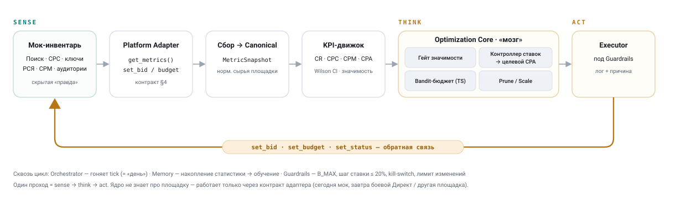

# Маркетинговый агент — самооптимизирующееся ядро (фаза 1)

Прототип рекламного агента, который ведёт кампании как толковый бид-менеджер: читает
метрики, считает KPI с учётом **статистической значимости**, сам крутит ставки и
перераспределяет бюджет к **целевому CPA**, отсекает убыточное и масштабирует прибыльное —
и **учится по метрикам**, а не по жёстким зашитым порогам.

Площадка — **Яндекс Директ**: поиск (CPC) + РСЯ (CPM), ручные ставки. Реализовано на
**реалистичном мок-симуляторе** аукциона. Боевой коннектор — осознанно вне фазы 1 (см.
[«Границы»](#границы-и-next-step--честно)).

`Python · numpy / pandas · 80 тестов · детерминированный прогон по SEED`

Источник истины по логике — символьная спецификация
[`spec/spec_marketing_agent_core.md`](spec/spec_marketing_agent_core.md) (ред. 3).
Источник истины по числам — [`src/config.py`](src/config.py).

---

## Результат (TL;DR)

Демо-прогон: 60 «дней» (тиков), 20 армов (12 поиск + 8 РСЯ), **один и тот же скрытый
сценарий** для трёх конфигураций.

| | CPA_acct | Σ конверсий | Σ расход | ROMI |
|---|---:|---:|---:|---:|
| **Агент** | **206 ₽** | 2002 | 408 820 ₽ | **3.53** |
| Baseline · равный бюджет + фикс. ставка | 215 ₽ | 2183 | 481 084 ₽ | 3.48 |
| Oracle · оптимум на истинных параметрах | 107 ₽ | 2611 | 278 667 ₽ | 8.21 |

- Агент **бьёт baseline по CPA** (206 vs 215 ₽) и по ROMI, тратя при этом на ~15% меньше.
- Достигает **77% конверсий «всеведущего» оракула**, не зная истинных параметров армов.
- Честный нюанс: при меньшем расходе агент берёт меньше объёма (2002 vs 2183 конверсии) —
  следствие консервативного потолка бюджета на арм; разбор в [«Границы»](#границы-и-next-step--честно).

Воспроизвести: `python run.py` → артефакты в `dashboard/sample/`.

---

## Архитектура

Замкнутый цикл **sense → think → act**, один проход = «день» (`tick`):



> Интерактивная версия: [`docs/architecture.html`](docs/architecture.html).

**Ключевое решение — platform-agnostic adapter.** Ядро (KPI, оптимизатор, guardrails,
оркестратор) не знает про Яндекс — оно работает только через контракт `PlatformAdapter`
(`get_metrics / set_bid / set_budget / set_status`). Сегодня за контрактом — мок; завтра
тем же ядром можно управлять боевым Директом или другой площадкой, заменив **одну**
реализацию адаптера.

Слои:

- **Adapter + мок** — две модели аукциона (поиск CPC, РСЯ CPM) со скрытой «правдой»
  (истинные CTR/CR/спрос), которую агент не видит. Ставка управляет ценой и объёмом
  (убывающая отдача) → значит CPA **управляем** через ставку.
- **KPI-движок** — превращает сырые счётчики в оценки с доверием.
- **Optimization Core** («мозг») — гейт значимости, контроллер ставок, bandit-аллокация
  бюджета, prune/scale.
- **Guardrails** — жёсткие инварианты (потолок расхода, шаг ставки, kill-switch, лимит
  изменений за тик).
- **Memory** — накопление статистики (это и есть обучение) + лог решений.

---

## На чём считаю метрики

CPA — главная и **единая цель** для обоих типов инвентаря; различается только формула от
ставки (CPC у поиска, CPM у РСЯ).

Проблема малых данных: сырые CTR/CR шумят (1 клик из 2 ≠ CR 50%). Решения:

- **Сглаживание Beta** — оценки CR/CTR с приором, устойчивы при малом `n`.
- **Доверительные интервалы Wilson** — на их основе строятся границы CPA: `CPA_lo`
  (лучший случай) и `CPA_hi` (худший). **Решения принимаются по границам, а не по точечной
  оценке:** паузим, только если *даже лучший* случай хуже цели; масштабируем, только если
  *даже худший* лучше. Так агент не дёргается на шуме.
- **Статистический гейт** — менять ставку можно после `N_MIN_BID` кликов, паузить — после
  `N_MIN_PAUSE`; для РСЯ дополнительный порог по показам. Недоисследованные армы помечаются
  `EXPLORING` и получают долю explore-бюджета.

---

## Как заложена самооптимизация

Три рычага + обучение по метрикам, без жёстких «если CPA > X — стоп»:

1. **Контроллер ставок → целевой CPA.** Демпфированная пропорциональная подстройка:
   `ratio = TARGET / CPA_est`, демпфирование `^γ`, шаг ограничен `MAX_STEP` (20%). CPA выше
   цели → ставка вниз, ниже → вверх. Плавно, без раскачки.

2. **Bandit-аллокация бюджета (Thompson sampling, единый пул).** Все активные армы — поиск
   *и* РСЯ — конкурируют за общий дневной бюджет. Эффективность каждого арма **сэмплируется
   из апостериорного Beta-распределения**; бюджет льётся пропорционально. Это и есть обучение
   по метрикам: чем больше данных, тем точнее апостериор → бюджет сам стекается к выгодным
   армам. Единый пул честно сравнивает поиск и РСЯ по конверсиям на рубль. Explore-резерв
   гарантирует новым армам шанс.

3. **Отсечение и масштабирование.** Уверенно дорогие армы → пауза; уверенно прибыльные,
   упёршиеся в лимит, → масштаб (потолок бюджета вверх). «Уверенно» = по границам Wilson.

Поверх — **guardrails**: суммарный расход ≤ `B_MAX`, шаг ставки ≤ 20%, не более `N`
изменений за тик (имитация лимитов API), **kill-switch** (если скользящий CPA аккаунта
улетел выше катастрофического — заморозка изменений и алерт человеку; после прогрева).

И **объяснимость** — каждое решение пишет человекочитаемую причину:

```
[tick 23] network "n3": ПАУЗА
  причина: CPA_lo=340₽ > target*1.5=300₽ при 5200 показах / 90 кликах — уверенно дорог
```

---

## Как проверяю, что это работает

- **Детерминизм** — весь прогон воспроизводим по `SEED`. RNG мока и RNG бандита — раздельные
  потоки, обе чистые функции от `(SEED, tick)`. Тест: два прогона с одним SEED идентичны
  до записи решений.
- **Oracle (верхняя планка)** — оптимум на истинных скрытых параметрах: предел того, чего
  вообще можно достичь. С ним сравнивается агент.
- **Baseline (нижняя планка)** — «равный бюджет + фикс. ставка». Агент обязан бить его по CPA.
- **80 тестов** — формулы KPI, Wilson, мок-аукцион, оптимизатор, guardrails, детерминизм и
  инварианты прогона: ни один тик не превышает `B_MAX`; нет пауз до гейта; шаг ставки ≤
  `MAX_STEP`.

---

## Как собирал и почему так

Метод — **спецификация-first** с жёстким ревью-гейтом:

- Сначала **символьная спецификация** ядра (формулы, инварианты, контракты). Числа вынесены
  в `src/config.py` — единственный источник истины по значениям; спека остаётся про логику.
  Это позволяет менять параметры, не трогая формулы, и наоборот.
- Реализация — **9 атомарных коммитов по слоям** (`types → config → kpi → adapter+mock →
  optimizer → guardrails+memory → orchestrator → eval`). Каждый коммит **ревьюился против
  спеки и инвариантов** до фиксации: дифф читался построчно, формулы сверялись независимо,
  поведение подтверждалось тестами. «Build passed» ≠ «работает корректно».
- Разработка — AI-ассистированная: исполнение кода вёл агент-разработчик под мою
  спецификацию и ревью-гейт; архитектура, ключевые решения и контроль качества — мои.

Ключевые решения и почему:

- **CPA как единая цель** обоих типов инвентаря → одно ядро вместо двух; поиск и РСЯ
  сравнимы по конверсиям на рубль.
- **Bandit вместо жёстких порогов** → агент учится по данным и сам перетекает к выгодному,
  а не следует зашитым правилам.
- **Мок как «источник правды» + оракул** → можно *измерить*, насколько агент близок к
  оптимуму; на боевом аккаунте этого не сделать (истинных параметров никто не знает).
- **Решения по границам Wilson, а не по точечному CPA** → не реагируем на шум малых выборок.

---

## Границы и next step — честно

Фаза 1 — это **ядро на моке**, не готовый к продакшену инструмент:

- **Боевой Директ** — фаза 2: заменить мок на коннектор (OAuth, Reports API, управление
  ставками/стратегиями). Контракт адаптера при этом не меняется. Нюанс: ручной CPM в РСЯ
  на боевом ограничен — `target CPA` агента маппится на CPA-автостратегию Директа.
- **Другие площадки** (Google/Meta/Telegram) — новая реализация адаптера, ядро §6–§8
  переиспользуется без изменений.
- **LLM-слой** — генерация текстов/ключей, трактовка аномалий, формулировка стратегии.
  Намеренно вне ядра: математика оптимизации должна быть детерминированной и проверяемой.
- **Известный хвост:** агент недорасходует бюджет под консервативным потолком на арм
  (`0.3·B`) — отсюда меньше объёма при лучшем CPA. Это **тюнинг** (поднять потолок / доливать
  остаток после аллокации), а не баг: логика честно следует спеке, а потолок защищает от
  перелива всего бюджета в один арм.

---

## Установка и запуск

```bash
python -m venv .venv
source .venv/bin/activate            # Windows: .venv\Scripts\activate
pip install -r requirements.txt

python run.py                         # демо: агент vs baseline vs oracle → dashboard/sample/
pytest -q                             # 80 тестов
```

Что смотреть после `run.py` в `dashboard/sample/`:

- `comparison.csv` — итоговая таблица трёх конфигураций;
- `cpa_acct.png` — сходимость CPA к цели;
- `conversions.png` — конверсии по тикам (за тик и накопленные);
- `budget_split.png` — переток бюджета поиск ↔ РСЯ;
- `decisions_sample.txt` — лог решений с причинами (объяснимость).

---

## Структура

```
src/
  types.py          канонная модель данных (§2)
  config.py         все параметры (§11) — источник истины по числам
  kpi.py            KPI, Wilson, CPA / eff / границы (§3)
  adapter.py        контракт PlatformAdapter (§4)
  mock_direct.py    MockYandexDirect: два аукциона, скрытые параметры, оракул-доступ (§5)
  optimizer.py      гейт, контроллер ставок, bandit-бюджет, prune / scale (§6)
  guardrails.py     жёсткие инварианты (§7)
  memory.py         состояния, накопление счётчиков, лог + рендер решений (§9, §10)
  orchestrator.py   цикл tick (§8)
  oracle.py         оптимум на истинных параметрах — верхняя планка приёмки (§12)
  baselines.py      бейзлайн: равный бюджет + фикс. ставка
run.py              демо-прогон + сбор артефактов (§12)
spec/               символьная спецификация ядра (ред. 3)
docs/               диаграмма архитектуры (svg + интерактивный html)
dashboard/sample/   готовые артефакты демо-прогона (для просмотра без запуска)
tests/              pytest — 80 тестов
```

---

## Лицензия

**Evaluation-only** — материал тестового задания, предоставлен для ознакомления и оценки.
См. [`LICENSE`](LICENSE).
